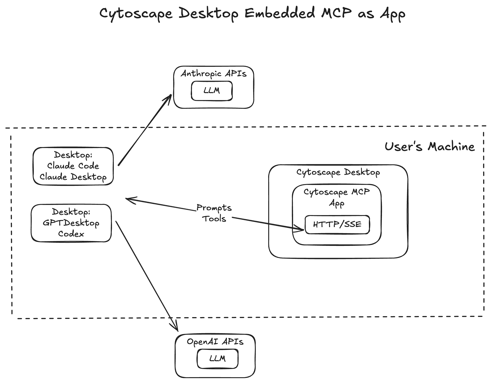

[gradle]: https://gradle.org/
[java]: https://www.oracle.com/java/index.html
[git]: https://git-scm.com/
[make]: https://www.gnu.org/software/make
[cytoscape]: https://cytoscape.org/
[mcp]: https://modelcontextprotocol.io/
[ndex]: https://www.ndexbio.org/

Cytoscape MCP Server
=======================================

An embedded [Model Context Protocol (MCP)][mcp] server for [Cytoscape Desktop][cytoscape], packaged as a Cytoscape App. AI clients such as Claude Desktop connect to Cytoscape over HTTP and invoke tools that control the desktop application directly — loading networks, setting active views, and more.



**NOTE:** This app is experimental. The interface and available tools are subject to change.

## How It Works

Once installed, the app publishes an MCP endpoint inside Cytoscape's existing CyREST HTTP server — AI clients connect to the MCP endpoint with Streamable HTTP transport and call MCP tools which drive activity on the Cytoscape desktop display. 

The app also adds two visual indicators to the Cytoscape Desktop UI:

### MCP toolbar button
a bold **MCP** button in the bottom-left status bar. The label is green when the MCP server is running and red when it is not. Clicking it opens the Agent Configuration dialog which displays the full MCP url and connection instructions for all supported agents.

### Task History entries
every MCP tool invocation is recorded in Cytoscape's Task History panel (**View > Show Task History**), so you can see exactly which tools an agent called and when.

```
AI Agent──► HTTP──► http://localhost:{rest.port}/mcp ──► Cytoscape Desktop
                                                               └── load network from NDEx or file
                                                               └── get loaded network views
                                                               └── set current network view
                                                               └── create network view
```

## Requirements

* [Cytoscape][cytoscape] 3.10 or above
* Internet connection (for loading networks from [NDEx][ndex])
* An MCP-compatible AI client that also supports the Streamable HTTP transport(not SSE which is [deprecated as of 02/2025](https://auth0.com/blog/mcp-streamable-http/)) (e.g. Claude Desktop)

## Try it! 

### Build from Source

Requirements:
* [Java][java] 17 with JDK
* [Git][git]
* [Make][make]

```bash
git clone https://github.com/idekerlab/cytoscape-mcp
cd cytoscape-mcp
make build
```

The JAR is produced at `build/libs/cytoscape-mcp-<VERSION>.jar`.

For a full list of build targets:
```bash
make help
```
### Desktop Installation

1. Get the mcp app jar:
    * Download the latest `cytoscape-mcp-<VERSION>.jar` from the [Releases](../../releases) page.
    * or [Build](#building-from-source) the jar 
2. Open Cytoscape Desktop.
3. Navigate to **Apps > App Manager > Install from File**.
4. Select the file path to the MCP App JAR and restart Cytoscape if prompted.

After startup, the MCP status can be viewed via the [MCP button](#mcp-toolbar-button) in the status bar.

Refer to [Diagnostics](docs/AgentConfiguration.md#diagnostics) for more information on how to externally inspect and verify the Mcp server.

### Connecting an Agent to Cytoscape Desktop
See [docs/AgentConfiguration.md](docs/AgentConfiguration.md) for step-by-step setup instructions for Claude Desktop, Claude Code, GitHub Copilot (VS Code), GitHub Copilot CLI, and OpenAI Codex CLI.

### Activate the MCP server from Agent prompts:
Try some Prompts to chaange states on the Cytoscape Desktop from Agent.
* `load network id 63836e7b-ca44-11f0-a218-005056ae3c32 into cytoscape` - will load `Yeast ergosterol` network that resides on ndexbio.org.
* `/cytoscape_network_wizard` - this will work on most agents that support mapping MCP prompts directly to 'slash' commands. It will start cytoscape network wizard interactive flow at agent prompt.
* `start cytoscape network wizard` - will trigger llm to request starting the cytoscape network wizard prompt sequence.


## Available Cytoscape Desktop MCP Artifacts

| Tool | Description |
|------|-------------|
| `load_cytoscape_network_view` | Load a network into Cytoscape from [NDEx][ndex] (by UUID), a native network format file, or a tabular data file with column mapping. Creates a new network collection and view, and sets it as the current network |
| `get_loaded_network_views` | Enumerate all network collections currently loaded in Cytoscape with their views, node counts, and edge counts. Read-only; does not modify state |
| `set_current_network_view` | Set the specified network and view as the current (active) network and view in Cytoscape. Both `network_suid` and `view_suid` are required |
| `create_network_view` | Create a visual view for a network that currently has no view. Sets the new view and its network as the current network and view |
| `inspect_tabular_file` | Inspect a tabular data file to determine whether it is an Excel workbook (`.xls`/`.xlsx`). If Excel, returns the list of sheet names; if not, returns the detected file extension (e.g. `.csv`, `.tsv`) |
| `get_file_columns` | Read column headers and up to three sample rows from a tabular file. For Excel files supply `excel_sheet`; for text files supply `delimiter_char_code` |

| Prompt | Description |
|------|-------------|
| `cytoscape-guidelines` | General behavioral guidelines for all Cytoscape tool interactions — in particular, how to handle connectivity failures when Cytoscape Desktop is not running |

**Example activation prompts** — after connecting your agent, try this to load the Yeast ergosterol network:

> Load the NDEx network 63836e7b-ca44-11f0-a218-005056ae3c32 into Cytoscape


## MCP Configuration properties

Properties are editable at runtime via **Edit > Preferences > Properties > cytoscapemcp**:

| Property | Default | Description |
|----------|---------|-------------|
| `mcp.ndexbaseurl` | `https://www.ndexbio.org` | NDEx base URL (takes effect immediately) |

## Documentation

Full documentation is in the `docs/` directory:

- [Agent Configuration](docs/AgentConfiguration.md) — connecting Claude Desktop, Claude Code, GitHub Copilot, Codex CLI, and others
- [User Manual](docs/UserManual.md) — configuration reference and available tools
- [Tutorial](docs/Tutorial.md) — end-to-end walkthrough: install, connect, load a network
- [FAQ](docs/FAQ.md) — common questions and troubleshooting

## COPYRIGHT AND LICENSE

[Click here](LICENSE)

## Acknowledgements

* TODO: denote funding sources
